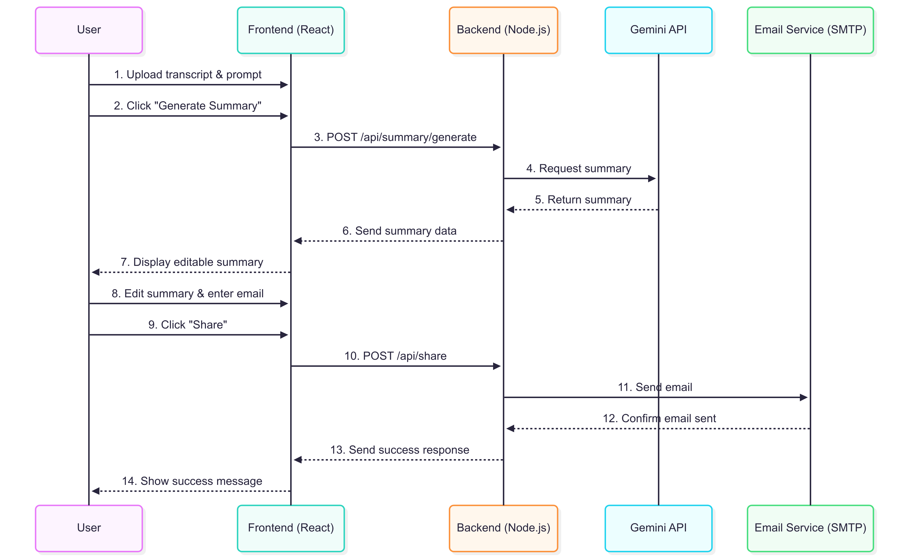

# Sudhanshu‑Lumio

AI-powered meeting notes summarizer and sharer. Paste or upload a transcript, get a clear summary, and share it by email.

- Frontend: React + Tailwind
- Backend: Node.js + Express
- AI: Gemini (via service wrapper)
- Email: SMTP

## High-Level Design (HLD)

> Place the provided diagram image at: `docs/hld-sequence.png`  
> If it does not render, ensure the file exists at that path.



Flow (matches the diagram):
1. User uploads transcript and optional prompt.
2. Clicks “Generate Summary”.
3. Frontend calls POST `/api/v1/summary/generate`.
4. Backend requests summary from Gemini API.
5. Gemini returns summary to backend.
6. Backend sends summary to frontend.
7. Frontend displays an editable summary.
8. User edits summary and enters recipient email.
9. User clicks “Share”.
10. Frontend calls POST `/api/v1/share`.
11. Backend sends email via SMTP.
12. SMTP confirms send.
13. Backend returns success to frontend.
14. Frontend shows success.

## What it does (simple)

- Turns long meeting transcripts into short, useful summaries.
- Lets users edit before sending.
- Shares summaries by email.

## Key features

- Upload/paste transcript text
- AI summary generation (concise, action-focused)
- Inline editing of summary
- One-click email share
- Simple REST API

## Project layout

- `frontend/` — React app (components, styles, tests)
- `backend/` — Express API (routes, controllers, services)
  - `services/gemini.service.js` — AI calls
  - `services/email.service.js` — SMTP email
  - `routes/*.routes.js`, `controllers/*.js`
  - `tests/*.test.js`
- `Dockerfile` in each subproject

## Tech stack

- React, Tailwind CSS
- Node.js, Express, Jest/Supertest
- Gemini API (LLM)
- SMTP (Nodemailer)
- Docker (optional)

## Quick start (local)

Prereqs:
- Node.js 18+ and npm
- (optional) Docker

Backend:
- cd backend
- npm install
- copy `.env` and set variables (see below)
- npm run dev

Frontend:
- cd frontend
- npm install
- set any `.env` values
- npm start

Open http://localhost:3000

## Environment variables

Backend (`backend/.env`):
- PORT=4000
- CORS_ORIGIN=http://localhost:3000
- GEMINI_API_KEY=your_key
- GEMINI_MODEL=gemini-1.5-pro
- SMTP_HOST=smtp.example.com
- SMTP_PORT=587
- SMTP_SECURE=false
- SMTP_USER=your_user
- SMTP_PASS=your_pass
- FROM_EMAIL=“Lumio <no-reply@example.com>”

Frontend (`frontend/.env`):
- REACT_APP_API_BASE=http://localhost:4000

Adjust names if they differ from your config files.

## API

Base URL: `http://localhost:4000/api/v1`

- POST `/summary/generate`
  - Body: `{ "transcript": "string", "prompt": "optional string" }`
  - Response: `{ "summary": "string" }`

- POST `/share`
  - Body: `{ "summary": "string", "to": "email", "subject": "optional" }`
  - Response: `{ "ok": true }`

Example:
```
curl -X POST "$REACT_APP_API_BASE/api/v1/summary/generate" \
  -H "Content-Type: application/json" \
  -d '{"transcript":"...","prompt":"bullet points"}'
```

## Tests

- Backend: `cd backend && npm test`
- Frontend: `cd frontend && npm test`

## Docker (optional)

- Backend: `docker build -t lumio-backend ./backend`
- Frontend: `docker build -t lumio-frontend ./frontend`

## Troubleshooting

- 401/403 from AI: check `GEMINI_API_KEY`.
- CORS errors: verify `CORS_ORIGIN` and frontend `REACT_APP_API_BASE`.
- Email not sent: check SMTP host/port/TLS and credentials.
- 500 errors: inspect backend logs.

## Contributing

- Create a branch, add tests, open a PR with a clear description.

## Keywords

AI, meeting notes, summarizer, transcript, email, share, Gemini, LLM, Node.js, Express, React, Tailwind, REST API, SMTP, Docker, testing
